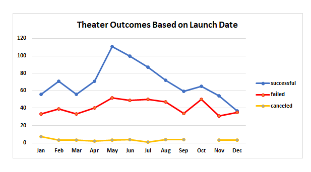
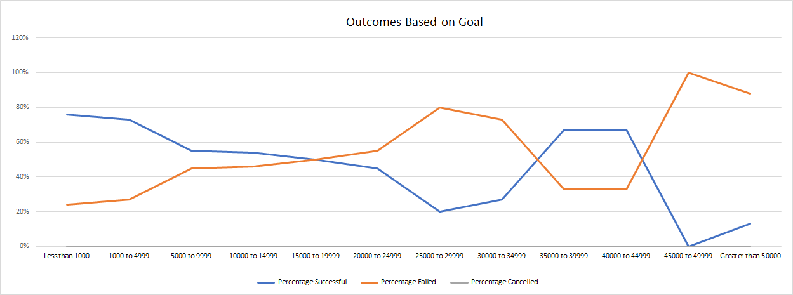

# Kickstarting with Excel

## Overview of Project
To create two new analyses from the kickstarter crowdfunding dataset in Excel.

- Outcomes based on Goals
- Outcomes based on Launch Date

Campaign visualization outcomes based on the above are to be discussed in this report.

### Purpose
Our client, Louise, wants to know how different kickstarter projects fared in relation to their launch dates and funding goals.

## Analysis and Challenges

### Analysis of Outcomes Based on Launch Date
By reviewing the chart we can see that successful campaigns move higher in the early part of the year and peak in May. We then see a monthly degradation of funded projects as this tapers off towards the end of the year.

### Analysis of Outcomes Based on Goals
There is a very clear and symmetrical relationship between successful and failed outcomes as you can see from the diagram. This symmetry of outcome takes place at the 50% threshold. Also, the summary data does not contain any instances of Cancelled, but values for Successful and Failed are present. For these two outcomes, we can identify this as a strong negative correlation to each other as they move in opposite directions to each other. 

### Challenges and Difficulties Encountered
- Formatting of the charts took a while to determine how percentages should be calculated and also displayed in the Goals/Outcomes analysis.

## Results
Two conclusions that can be reached about the Outcomes based on Launch Date analysis:
- In order for a successful project to have the best opportunity for funding the data visualization shows that the ideal target launch date should be late April to early May for 100% funding. In fact, if you can launch your campaign in late April it's very likely you can get up to 10% overfunding on your intended project. The window for full funding is very short and requires that you prepare in advance for the critical late April launch. Once you reach June, the data shows funding will decrease monthly for the remainder of the year to a low point in December.
- We also see a moderately positive correlation between successful and failed funding of projects. Both of these types will get funding but successful campaigns will get more funding generally. The data for cancelled campaigns appears to be mixed and inconclusive.

Conclusions based on Goals/Outcomes:
- From the Outcomes based on Goals analysis we can see projects that have a goal of under $20,000 or between $35,000 and 45,000 at this threshold tend to have a 50% or more chance of success. Campaigns that are funded at $5,000 or less have approximately 75% chance of success and approximate 65% chance of success between 
$35,000 and $45,000.
- Louise should target projects that require less than $20,000 or between $35,000 to $45,000 for a better opportunity for success.

Limitations of this dataset:
- The dataset may not be representative of all crowdfunding projects
- The data may of been collected from different sources which can cause issues of quality and consistency.
- We did not have any cancelled outcomes in the data timeframe, as such, the results may be different if we use a larger data set or outcomes of this value appear in the future
- There appears to be data missing for cancelled theatre campaigns in October 

Possible tables and/or graphs that we could create:
- Standard deviation, Mean, Mode, Median
- Box Whisker
